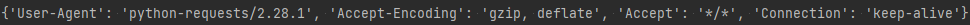
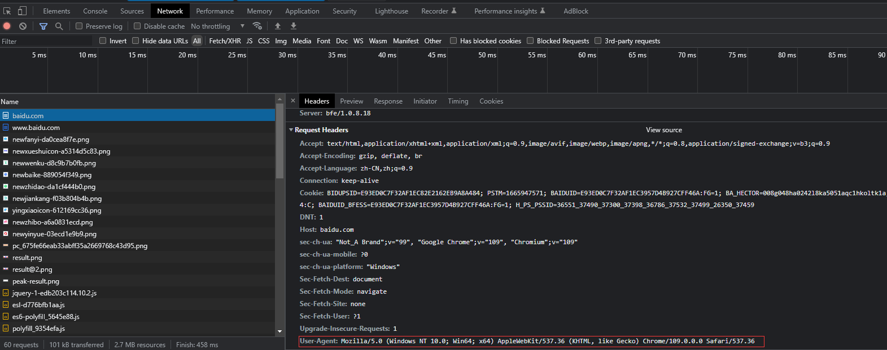
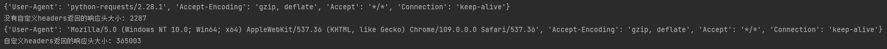
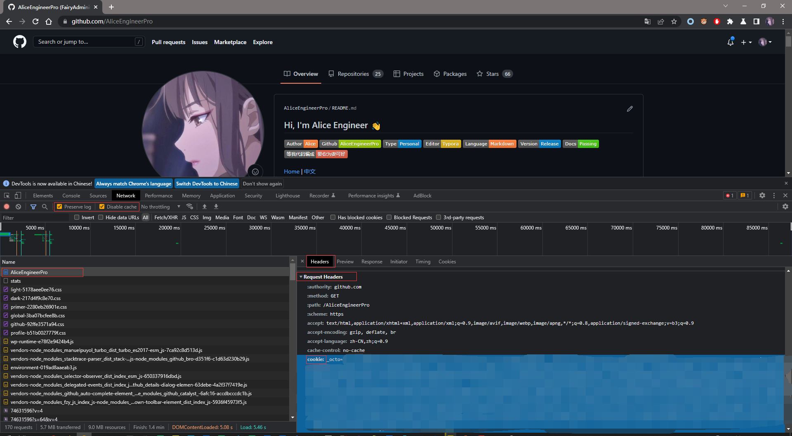
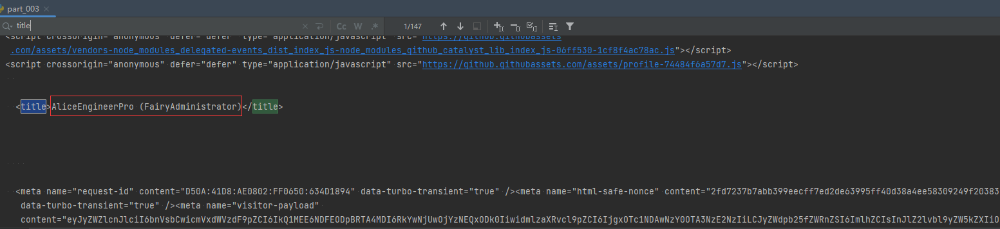

# requests模块发送请求

## 一. 发送带header的请求

> 我们先写一个获取百度首页的代码

```python
# coding: utf8
""" 
@File: part_002.py
@Author: Alice(From Chengdu.China)
@HomePage: https://github.com/AliceEngineerPro
@CreatedTime: 2022/10/17 15:26
"""

import os, sys

"""requests发送请求"""

import requests

url = 'https://baidu.com'
response = requests.get(url=url)
# print(response.content.decode())
# 打印响应对应请求的请求头信息
print(response.request.headers)
```

返回的请求头

 

### 1. 思考

1. 对比浏览器上百度首页的网页源码和代码中的百度首页的源码, 有什么不同?

   - 查看网页源码的方法:`右键`->`查看网页源代码` 

1. 代码中的百度首页的源码非常少,为什么?

   - 需要我们带上请求头信息

     > 模拟浏览器，欺骗服务器，获取和浏览器一致的内容

   - 请求头中有很多字段,其中User-Agent字段必不可少,表示客户端的操作系统以及浏览器的信息

### 2. 携带请求头发送请求的方法

`requests.get(url=url, headers=headers)`

- headers参数接收字典形式的请求头
- 请求头字段名作为key,字段对应的值作为value

### 3. 完成代码实现

> 从浏览器中复制User-Agent,构造headers字典;完成下面的代码后,运行代码查看结果 

  

```python
# coding: utf8
""" 
@File: part_002.py
@Author: Alice(From Chengdu.China)
@HomePage: https://github.com/AliceEngineerPro
@CreatedTime: 2022/10/17 15:26
"""

import os, sys

"""requests发送请求"""

import requests

url = 'https://baidu.com'
response = requests.get(url=url)
# print(response.content.decode())
# 打印响应对应请求的请求头信息
print(response.request.headers)

"""发送带headers的请求"""

# 定义请求头
headers = {
    'User-Agent': 'Mozilla/5.0 (Windows NT 10.0; Win64; x64) AppleWebKit/537.36 (KHTML, like Gecko) Chrome/109.0.0.0 Safari/537.36'
}

# 在请求头中带上User-Agent, 模拟浏览器发送请求
response = requests.get(url=url, headers=headers)
# 打印请求头
print(response.request.headers)
```

 

## 二. requests模块发送带参数的请求

> 我们在使用百度搜索的时候经常发现url地址中会有一个`?`,那么该问号后边的就是请求参数,又叫做查询字符串

### 1. 在url携带参数

直接对含有参数的url发起请求 

```python
# coding: utf8
""" 
@File: part_002.py
@Author: Alice(From Chengdu.China)
@HomePage: https://github.com/AliceEngineerPro
@CreatedTime: 2022/10/17 15:26
"""

import os, sys

"""requests发送请求"""

import requests

url = 'https://baidu.com'
response = requests.get(url=url)
# print(response.content.decode())
# 打印响应对应请求的请求头信息
print(response.request.headers)
print(f'没有自定义headers返回的响应头大小: {len(response.content.decode())}')

"""发送带headers的请求"""

# 定义请求头
headers = {
    'User-Agent': 'Mozilla/5.0 (Windows NT 10.0; Win64; x64) AppleWebKit/537.36 (KHTML, like Gecko) Chrome/109.0.0.0 Safari/537.36'
}

# 在请求头中带上User-Agent, 模拟浏览器发送请求
response = requests.get(url=url, headers=headers)
# 打印请求头
print(response.request.headers)
print(f'自定义headers返回的响应头大小: {len(response.content.decode())}')

"""发送带参数的请求"""

url = 'https://baidu.com/s?wd=python'
response = requests.get(url=url, headers=headers)
```

### 2. 通过params携带参数字典

1. 构建请求参数字典
1. 向接口发送请求的时候带上参数字典，参数字典设置给params

```python
# coding: utf8
""" 
@File: part_002.py
@Author: Alice(From Chengdu.China)
@HomePage: https://github.com/AliceEngineerPro
@CreatedTime: 2022/10/17 15:26
"""

import os, sys

"""requests发送请求"""

import requests

url = 'https://baidu.com'
response = requests.get(url=url)
# print(response.content.decode())
# 打印响应对应请求的请求头信息
print(response.request.headers)
print(f'没有自定义headers返回的响应头大小: {len(response.content.decode())}')

"""发送带headers的请求"""

# 定义请求头
headers = {
    'User-Agent': 'Mozilla/5.0 (Windows NT 10.0; Win64; x64) AppleWebKit/537.36 (KHTML, like Gecko) Chrome/109.0.0.0 Safari/537.36'
}

# 在请求头中带上User-Agent, 模拟浏览器发送请求
response = requests.get(url=url, headers=headers)
# 打印请求头
print(response.request.headers)
print(f'自定义headers返回的响应头大小: {len(response.content.decode())}')

"""发送带参数的请求"""

url = 'https://baidu.com/s'
# url = 'https://baidu.com/s?wd=python'
# response = requests.get(url=url, headers=headers)

# 请求参数是一个字典 即wd=python
params = {
    'wd': 'python'
}
# 带上请求参数发起请求，获取响应
response = requests.get(url=url, headers=headers, params=params)
```

## 三. 在headers参数中携带cookie

> 网站经常利用请求头中的Cookie字段来做用户访问状态的保持,那么我们可以在headers参数中添加Cookie,模拟普通用户的请求,我以github登陆为例

### 1. github登陆抓包分析

1. 打开浏览器,`右键`->`检查`,点击`Network`,勾选`Preserve log` 
1. 访问github登陆的url地址<https://github.com/login> 
1. 输入账号密码点击登陆后,访问一个需要登陆后才能获取正确内容的url;访问<https://github.com/{USERNAME}> 
1. 确定url之后, 再确定发送该请求所需要的请求头信息中的`User-Agent`和`Cookie` 

 

### 2. 代码完成

- 从浏览器中复制`User-Agent`和`Cookie` 
- 浏览器中的请求头字段和值与headers参数中必须一致
- headers请求参数字典中的Cookie键对应的值是字符串

```python
# coding: utf8
""" 
@File: part_003.py
@Author: Alice(From Chengdu.China)
@HomePage: https://github.com/AliceEngineerPro
@CreatedTime: 2022/10/17 16:10
"""

import os, sys

"""在headers参数中携带cookie"""

"""github示例"""

import requests

url = 'https://github.com/AliceEngineerPro'
# url = 'https://github.com/{USERNAME}'

# 构造请求头字典
headers = {
    # 从浏览器中复制过来的User-Agent
    'User-Agent': 'Mozilla/5.0 (Windows NT 10.0; Win64; x64) AppleWebKit/537.36 (KHTML, like Gecko) Chrome/109.0.0.0 Safari/537.36',
    # 从浏览器中复制过来的Cookie
    'Cookie': 'cookie字符串'
}

# 请求头参数字典中携带cookie字符串
response = requests.get(url, headers=headers, proxies={'http': 'http://127.0.0.1:56789'})
print(response.content.decode())
```

### 3. 运行代码验证结果

> 在打印的输出结果中搜索title,html中的标题文本内容如果是你的github账号,则成功利用headers参数携带cookie,获取登陆后才能访问的页面

 

